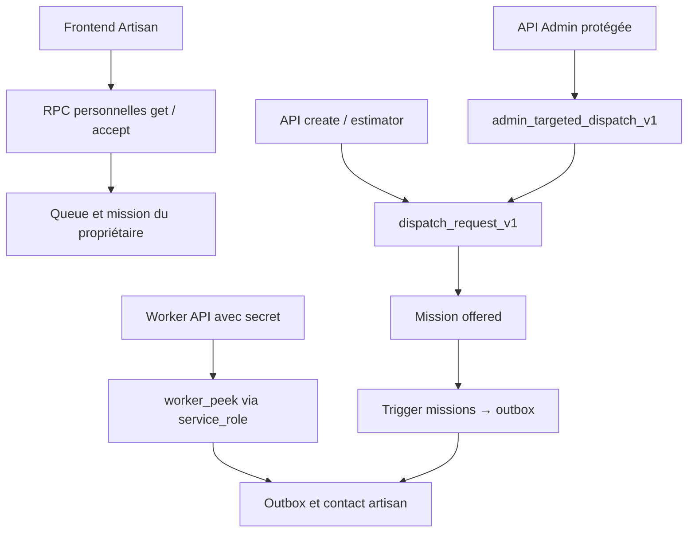
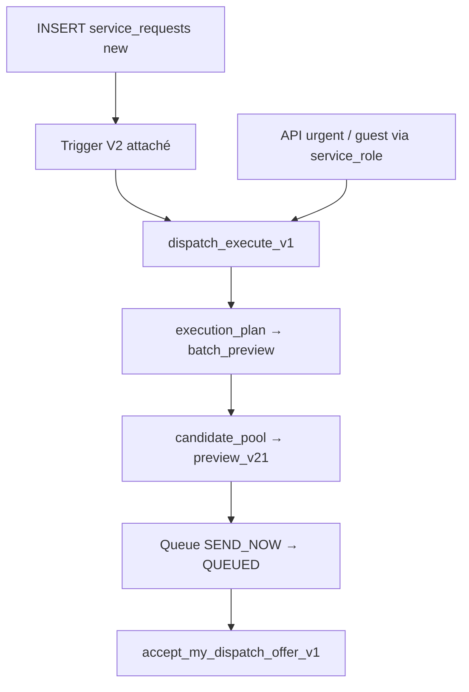

# Call graph et preuves de non-régression

Baseline inspectée : `cb55e54cafb3792ed561b21b0da6bc104599d2e7`. Toutes les conclusions portent sur le code déployé à ce SHA et le catalogue Production capturé, pas sur des appels métier réalisés en Production.

## Entrées réellement reliées

Le deuxième diagramme montre une chaîne d’évaluation puis l’écriture effectuée par `dispatch_execute_v1`, pas une écriture effectuée par `preview_v21`.

| Entrée | Fichier / définition exacts | Autorité observée | Effet du patch |
| --- | --- | --- | --- |
| Création demande | api/create-request-fn/index.js:274 | service_role → dispatch_request_v1 | Aucun changement de grant |
| Estimation confirmée | api/estimator-v1/index.js:1535 | service_role → dispatch_request_v1 | Aucun changement de grant |
| Urgence / invité | api/urgent-request-fn/index.js:149 | service_role → dispatch_execute_v1 | Aucun changement de grant ; les commentaires V1 de ce fichier sont périmés |
| Ciblage Admin | api/admin-targeted-dispatch-fn/index.js:198 | Session vérifiée, public.users.role admin, puis service_role → admin_targeted_dispatch_v1 | Aucun changement de grant |
| Dashboard Artisan | js/fixeo-artisan-dashboard-v2.js:284 et :1556 | authenticated → get_my_dispatch_offers_v1 / accept_my_dispatch_offer_v1 | Grants et corps conservés ; S17–S20 |
| Worker WhatsApp | api/dispatch-whatsapp-worker-fn/index.js:50 | POST, secret worker exigé, puis service_role → worker_peek | Retrait des rôles navigateur sans effet sur l’appelant identifié ; S14/S22 |
| Trigger demande | trg_dispatch_v2_on_service_request | AFTER INSERT, SD owner postgres → dispatch_execute_v1 | Corps/attachement inchangés ; S09/S10/S12 |
| Trigger mission | trg_enqueue_dispatch_notification_v1 | AFTER INSERT mission offered, SD owner postgres → outbox | Corps/attachement inchangés ; S11/S15 |
| Création Enterprise | public.create_enterprise_request | RPC métier → INSERT service_requests → trigger V2 | Aucun grant/corps modifié ; chaîne de trigger préservée |
| Création Diagnostic | public.create_diagnostic_quote_request_v1 | RPC serveur → INSERT service_requests → trigger V2 | Aucun grant/corps modifié |
| Lecture progrès Diagnostic | api/diagnostic/intervention.js:87/:94 | Transport serveur → SELECT queue/outbox du dossier lié | Tables service_role inchangées |

`vercel.json` construit et route **api/dispatch-whatsapp-worker-fn/index.js** vers `/api/dispatch-whatsapp-worker`. Le fichier plat `api/dispatch-whatsapp-worker-fn.js` est une ancienne variante non référencée par cette route/build. Le handler déployé utilise PEEK et est en **DRY_RUN** : aucun appel d’envoi Meta dans ce code. L’en-tête worker est contrôlé avant la lecture RPC. Les valeurs des secrets n’ont pas été consultées.

## Appels internes exhaustifs trouvés dans les corps

| Appelant | Appelé |
| --- | --- |
| admin_targeted_dispatch_v1 | dispatch_request_v1 |
| auto_dispatch_service_request_v1 (non attaché) | dispatch_request_v1 |
| dispatch_action_preview_v1 | dispatch_fallback_router_v1 |
| dispatch_advance_v1 | dispatch_expire_contacted_v1 ; dispatch_release_next_batch_v1 |
| dispatch_batch_preview_v1 | dispatch_candidate_pool_v1 |
| dispatch_candidate_pool_v1 | dispatch_preview_v21 |
| dispatch_execute_v1 | dispatch_execution_plan_v1 |
| dispatch_execution_plan_v1 | dispatch_batch_preview_v1 |
| dispatch_fallback_router_v1 | dispatch_preview_v21 ; resolve_service_category_v1 |
| dispatch_preview_v21 | resolve_service_category_v1 |
| dispatch_release_next_batch_v1 | dispatch_batch_preview_v1 |
| trigger_dispatch_v2_on_service_request | dispatch_execute_v1 |

`resolve_service_category_v1` appelle `normalize_service_category_v1`. Les RPC d’offre climatisation/serrurerie lisent aussi la queue directement ; leurs ACL et son contenu ne sont pas modifiés. Aucun autre appel dispatch explicite trouvé dans les 134 corps public/fixeo_private. Le JSON conserve aussi les dépendances `pg_depend`, dont les deux triggers attachés. Les dépendances textuelles SQL/PLpgSQL peuvent manquer dans `pg_depend` : sa seule absence n’a jamais servi de preuve.

## Backup / fonctions inutilisées / cron

- Aucun appelant applicatif, SQL explicite ou trigger trouvé pour `dispatch_request_v1_backup_20260821(uuid)`. Aucun DROP proposé. Son écriture de mission est confirmée par le corps et par S13 **local uniquement**.
- `auto_dispatch_service_request_v1()` n’est attachée à aucun trigger de Production. Aucune activation proposée.
- Aucune Edge Function Supabase déployée retournée par l’inventaire du projet.
- Pas de relation `cron.job` ni d’extension pg_cron dans le catalogue inspecté.
- Seul cron déclaré dans `vercel.json` : `/api/diagnostic-maintenance` à `0 * * * *`.
- Les statistiques de fonctions ne fournissent pas d’historique d’appels exploitable. La fiche projet Vercel disponible ne constitue pas un inventaire de schedulers externes.
- Impossible d’exclure un consommateur extérieur non inventorié. Les permissions privilégiées restent intactes, précisément pour éviter de supprimer un usage d’exploitation inconnu. Aucun test HTTP du worker ni invocation RPC Production.

## Frontière de la preuve

Les 31 scénarios locaux utilisent les corps dispatch exacts, les ACL effectives et les vrais triggers dans PostgreSQL 17 en mémoire. Ils établissent la compatibilité ACL/trigger/RPC des chemins testés ; ce ne sont ni un E2E Production, ni un test de concurrence multi-connexion, ni une recette des offres tarifées ou des fournisseurs de notification. Aucune garantie de non-régression de consommateurs externes inconnus n’est inventée.
